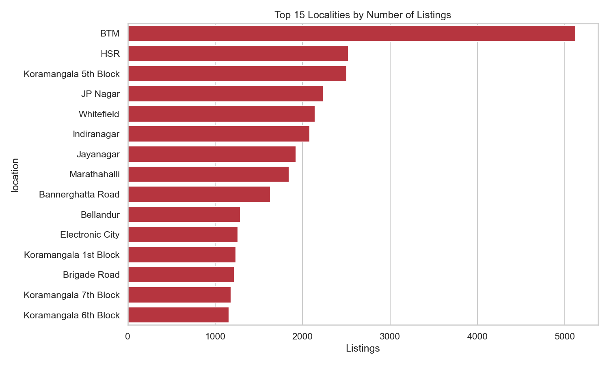
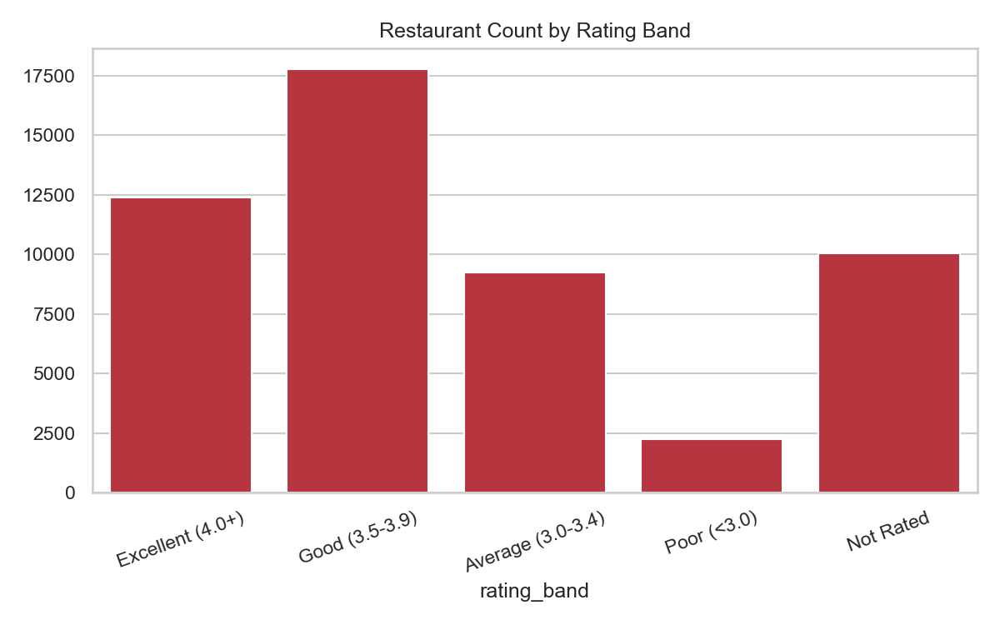
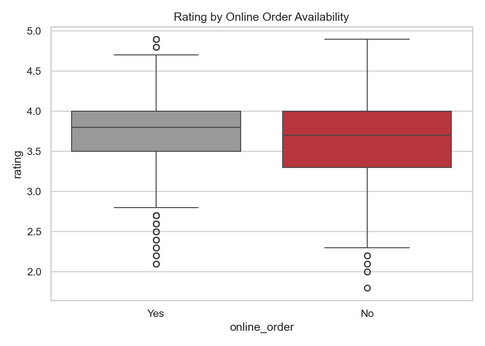
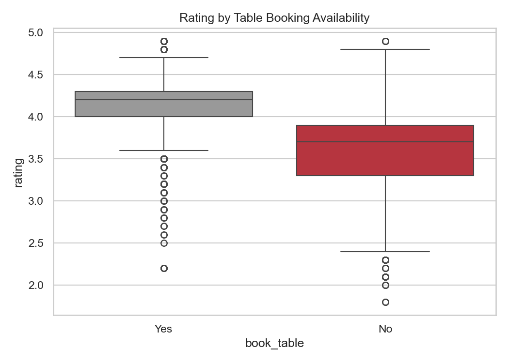
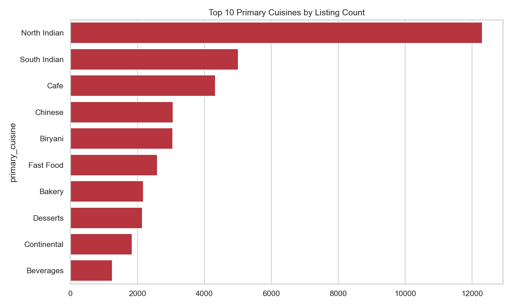
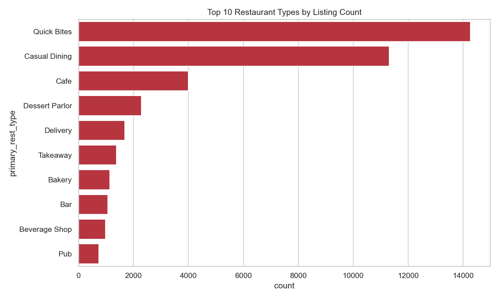
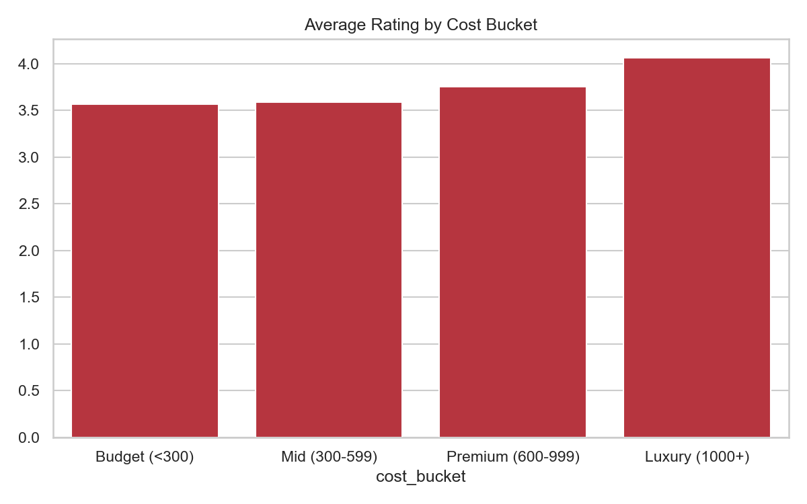
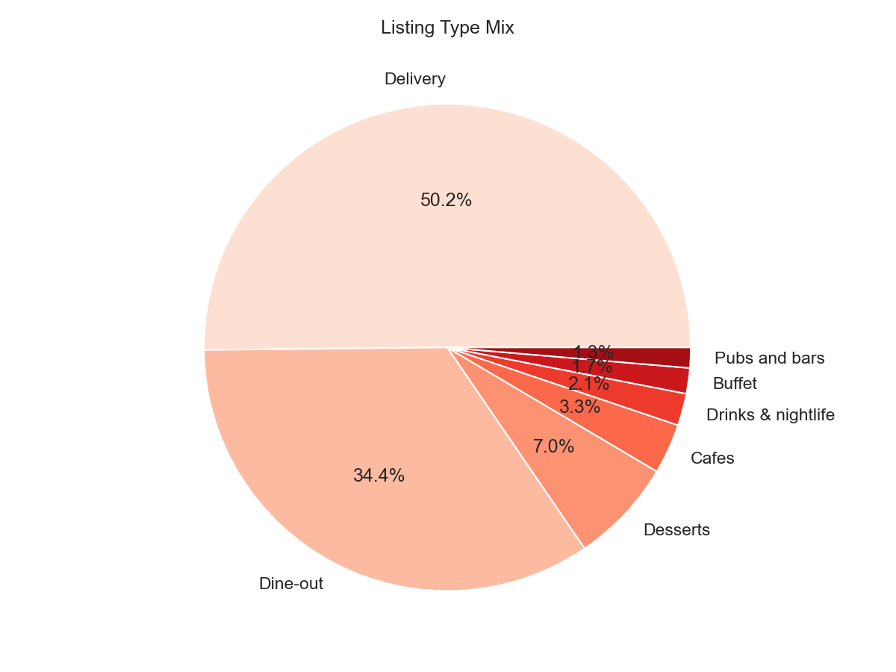

# Zomato Bangalore Restaurant Market Analysis

**An end-to-end Business Analyst / Data Analyst case study** — from a raw, messy 51,717-row export to a fully documented business decision: where should a restaurant operator (or Zomato itself) focus, and what actually drives customer ratings and engagement in Bangalore's restaurant market?

This isn't a notebook of charts. It's a full project lifecycle — business requirements, data cleaning, exploratory analysis, BI data modeling, interactive dashboards, and a recommendations report — built and documented the way a BA/DA would deliver it inside a company.

---

## TL;DR for recruiters

| | |
|---|---|
| **Dataset** | [Zomato Bangalore Restaurants](https://www.kaggle.com/datasets/rajeshrampure/zomato-dataset) — 51,717 raw listings, 17 columns |
| **Process** | Business requirements → data profiling → cleaning pipeline → EDA → star-schema modeling → Power BI dashboard → findings & recommendations |
| **Tools** | Python (pandas, matplotlib, seaborn), Power BI Desktop (DAX, data modeling), Git/GitHub |
| **BA artifacts produced** | BRD, FRD, Data Mapping Document, Requirements Traceability Matrix, UAT Test Plan, Stakeholder/RACI Matrix — see [Documentation Index](#documentation-index) |
| **Headline finding** | Table booking availability is the single strongest signal in the dataset — restaurants offering it average **4.14★ vs 3.62★** and **~7x the votes** of those that don't |
| **Deliverable** | A 5-page interactive Power BI dashboard + an 11-page written report (BRD-to-recommendations) |

---

## Dashboard preview


| | |
|---|---|
|  |  |
|  |  |
|  |  |
|  |  |

---

## The business problem

> *Where and how should a restaurant be positioned in Bangalore to maximize customer rating and engagement — and what role do service features like online ordering and table booking actually play?*

This question came from four real stakeholder groups, each captured formally in the [Business Requirements Document](docs/08_BRD_business_requirements_document.md):

- **Expansion/Strategy teams** — where is the market saturated vs. open?
- **Marketing teams** — which cuisines and localities deserve campaign budget?
- **Restaurant partners** — what levers actually move their own rating and visibility?
- **Zomato Product/Ops** — does promoting service features (online order, table booking) move engagement enough to justify a push?

## Workflow

```
 1. Business Understanding         What's the problem? Who are the stakeholders? What KPIs answer it?
        │                          → docs/01_business_understanding.md, 08_BRD, 09_FRD
        ▼
 2. Data Understanding & Profiling Profile the raw 51,717-row CSV, document every quality issue
        │                          before writing a single cleaning rule
        │                          → docs/02_data_understanding.md
        ▼
 3. Data Cleaning Pipeline         Reproducible Python script: parse ratings, clean cost, derive
        │                          primary cuisine/type, flag true-unique restaurants, bucket fields
        │                          → scripts/01_clean_data.py, docs/03_data_cleaning_log.md
        ▼
 4. Exploratory Data Analysis      Quantify market concentration, rating drivers, cost relationships,
        │                          service-feature impact — every chart maps back to a stated KPI
        │                          → scripts/02_eda.py, docs/04_eda_insights.md
        ▼
 5. BI Data Modeling               Reshape cleaned data into a star schema (fact + bridge tables for
        │                          multi-valued cuisine/type fields) — built for correct aggregation,
        │                          not just flat CSVs
        │                          → scripts/03_prepare_bi_data.py, docs/10_data_mapping_document.md
        ▼
 6. Dashboard Build                Power BI: 7 DAX measures, modeled relationships, 5 report pages.
        │                          → powerbi/Zomato_Bangalore_Dashboard.pbix
        │                          → docs/05_powerbi_design_and_build_guide.md
        ▼
 7. UAT & Sign-off                 11 test cases verifying the pipeline and dashboard against
        │                          requirements; one real defect found and fixed (see below)
        │                          → docs/12_UAT_test_plan.md
        ▼
 8. Findings & Recommendations     Every recommendation traced back to a specific number, not a
                                    generic statement
                                    → docs/07_final_report.md, 11_RTM
```

## Key findings

| # | Finding | Evidence |
|---|---|---|
| 1 | **Market is concentrated**, not evenly spread — BTM (5,124 listings), HSR, Koramangala, JP Nagar, and Whitefield are saturated tech-corridor hotspots | `01_top_localities.png` |
| 2 | **Table booking is the strongest engagement signal in the data** — 4.14★ vs 3.62★ rating, ~7x the votes (1,147 vs 161) for restaurants that offer it | `05_online_order_vs_rating.png`, `06_book_table_vs_rating.png` |
| 3 | **Format quality varies widely** — Quick Bites (the single most common format, 14,266 listings) rates lowest at 3.55★; Pubs (4.10★), Bars, and Dessert Parlors rate highest | `08_top_rest_types.png` |
| 4 | **Niche cuisines outrate mass-market staples** — Modern Indian (4.31★), European (4.26★), and Japanese (4.19★) outrate North/South Indian despite far lower volume | `07_top_cuisines.png` |
| 5 | **Price correlates with quality, moderately** — average rating climbs from 3.56★ (Budget) to 4.06★ (Luxury), r ≈ 0.39 — real, but not deterministic | `10_cost_bucket_vs_rating.png` |
| 6 | **Top-voted restaurants share a profile** — Byg Brewski (16,345 votes, 4.9★), Toit, Truffles, AB's Absolute Barbecues: large-format, table-booking, premium-priced breweries/dine-out venues | locality deep-dive table |
| 7 | **19% of listings are unrated** — a meaningful population of fresh entrants not yet reflected in rating benchmarks | rating distribution |

Full write-up with every supporting number: [`docs/04_eda_insights.md`](docs/04_eda_insights.md) and [`docs/07_final_report.md`](docs/07_final_report.md).

## What this means for the business

| Audience | Recommendation |
|---|---|
| **New restaurant launch / expansion** | Avoid the most saturated localities unless differentiating strongly. Lead with table booking + a premium or niche-cuisine position — it's the single biggest lever this data shows. |
| **Existing Quick Bites / delivery-only operators** | The format has a structurally lower quality ceiling. Adding a dine-in or booking option is the most direct way to lift perceived quality and engagement. |
| **Marketing / cuisine strategy** | Promote niche cuisines (Japanese, European, Modern Indian) as premium differentiators instead of competing head-on in crowded North/South Indian volume segments. |
| **Zomato Product/Ops** | The table-booking correlation is strong enough to justify a controlled experiment: does *actively promoting* table-booking adoption among mid-tier restaurants lift their engagement, or is this purely a selection effect of already-premium restaurants? |

## The dashboard

Built live in Power BI Desktop — not exported from a template. Data model: 1 fact table + 2 bridge tables (for multi-valued cuisine/restaurant-type fields) + 1 pre-aggregated locality dimension, connected with modeled relationships, driving 7 reusable DAX measures.

| Page | What it answers |
|---|---|
| **Executive Summary** | All 6 headline KPIs + the 3 most important charts, in one screen |
| **Market Overview** | Where is the market concentrated, and how is it split by listing type? |
| **Ratings & Quality** | What drives a high rating — restaurant type, cuisine, rating distribution? |
| **Service Features Impact** | Does online ordering / table booking actually move rating and engagement? |
| **Locality Deep Dive** | Full sortable table of all 93 localities — drill-down for expansion planning |

→ `powerbi/Zomato_Bangalore_Dashboard.pbix` · design rationale + every DAX formula: [`docs/05`](docs/05_powerbi_design_and_build_guide.md)

## Data quality work (the unglamorous, necessary part)

The raw export wasn't analysis-ready. Found and fixed, with every decision logged:

- Ratings stored as inconsistent text (`"4.1/5"`, `"3.9 /5"`, `'NEW'`, `'-'`) → parsed to nullable numeric, with `'NEW'` correctly treated as *not yet rated*, not missing data.
- Cost stored as comma-formatted text (`"1,200"`) → cleaned to numeric.
- **Structural finding that mattered:** the same restaurant legitimately repeats once per `listed_in(type)` it's registered under (e.g. once for Delivery, once for Dine-out) — a naive duplicate count would have undercounted "true" unique restaurants by ~75%. Solved with an `is_unique_restaurant` flag based on first occurrence of (name, address), so every KPI distinguishes "listings" from "unique restaurants."
- Multi-valued `cuisines`/`rest_type` fields exploded into proper bridge tables instead of being flattened (which would have double-counted listings on every cuisine-level aggregation).

Full data dictionary and quality log: [`docs/02`](docs/02_data_understanding.md), [`docs/03`](docs/03_data_cleaning_log.md), [`docs/10`](docs/10_data_mapping_document.md).

## Quality assurance

This project went through an actual UAT pass before sign-off ([`docs/12`](docs/12_UAT_test_plan.md)) — 11 test cases, all passed. One real defect was caught and fixed: the initial "Avg Rating by Restaurant Type" chart was sorted by rating alone, surfacing statistically tiny categories (single-digit listing counts) at the top. Fixed with a minimum-sample-size filter (≥ 50 listings) before sign-off.

## Documentation index

This project is documented the way a BA/DA team produces requirements and handoff artifacts on the job — not just a README and some code.

| Doc | What it covers |
|---|---|
| [`01_business_understanding.md`](docs/01_business_understanding.md) | Problem statement, stakeholders, KPIs, scope |
| [`02_data_understanding.md`](docs/02_data_understanding.md) | Full data dictionary, quality issues found |
| [`03_data_cleaning_log.md`](docs/03_data_cleaning_log.md) | Auto-generated log of every cleaning transformation |
| [`04_eda_insights.md`](docs/04_eda_insights.md) | Every EDA finding with supporting numbers |
| [`05_powerbi_design_and_build_guide.md`](docs/05_powerbi_design_and_build_guide.md) | Dashboard design rationale + all DAX formulas |
| [`07_final_report.md`](docs/07_final_report.md) | Executive summary, findings, recommendations |
| [`08_BRD_business_requirements_document.md`](docs/08_BRD_business_requirements_document.md) | Formal business requirements document |
| [`09_FRD_functional_requirements_document.md`](docs/09_FRD_functional_requirements_document.md) | Functional specs, traced to business requirements |
| [`10_data_mapping_document.md`](docs/10_data_mapping_document.md) | Full source → cleaned → star-schema column mapping |
| [`11_RTM_requirements_traceability_matrix.md`](docs/11_RTM_requirements_traceability_matrix.md) | Every requirement traced to its deliverable and test evidence |
| [`12_UAT_test_plan.md`](docs/12_UAT_test_plan.md) | 11 test cases, results, and the one defect found & fixed |
| [`13_stakeholder_RACI_matrix.md`](docs/13_stakeholder_RACI_matrix.md) | Stakeholder register and RACI matrix |
| [`Zomato_Project_Complete_Report.docx`](docs/Zomato_Project_Complete_Report.docx) | All of the above, consolidated into a single shareable report |

## Repository structure

```
docs/        Every BA/DA artifact: BRD, FRD, data dictionary, cleaning log,
             EDA findings, BI design guides, RTM, UAT, final report
data/        raw/ (source CSV — see note below) and cleaned/ (cleaned + star-schema tables)
scripts/     Python pipeline: profiling → cleaning → EDA → BI data prep
dashboards/  EDA chart pack (11 charts) + locality summary export
powerbi/     Power BI dashboard (.pbix) and its source CSVs
```

> **Note on `data/raw/`:** the source CSV (~574 MB) is excluded from version control via `.gitignore` to keep the repo lightweight. Download it directly from [Kaggle](https://www.kaggle.com/datasets/rajeshrampure/zomato-dataset) and place it at `data/raw/zomato.csv` to reproduce the pipeline end-to-end.

## Reproducing this analysis

```bash
# 1. Place the raw Kaggle CSV at data/raw/zomato.csv
# 2. Run the pipeline in order:
python scripts/01_clean_data.py        # raw → cleaned dataset + cleaning log
python scripts/02_eda.py               # cleaned → EDA chart pack + insights
python scripts/03_prepare_bi_data.py   # cleaned → star-schema tables for BI tools
# 3. Open powerbi/Zomato_Bangalore_Dashboard.pbix in Power BI Desktop
```

## Honest limitations & what I'd push further

This is a **descriptive** analysis — it quantifies *what* is happening in the data (concentration, rating drivers, service-feature correlation), not a predictive or causal model, and the dataset has no revenue, footfall, or time-series data to validate causality. Documented transparently rather than overstated:

- A **revenue-impact model** — quantifying what closing the online-order/table-booking adoption gap is worth in commission terms — would turn the correlation into a business case, not just an observation.
- A **locality opportunity score** — a composite ranking of demand signal, competition density, rating gap, and cuisine gap — would recommend *where* to expand, rather than leaving that inference to the reader.
- Pairing this with review-text sentiment (the unused `reviews_list` field) or delivery-time data would help validate whether these correlations hold up to a causal test.

These are called out explicitly in the [RTM](docs/11_RTM_requirements_traceability_matrix.md) as open items, not hidden gaps.

## Tools

**Python** (pandas, matplotlib, seaborn) in a dedicated conda environment for cleaning and EDA · **Power BI Desktop** for the interactive dashboard (data modeling, DAX) · **Git/GitHub** for version control.

---

*Built by Mude Mamatha as a full-cycle Business Analyst / Data Analyst case study.*
